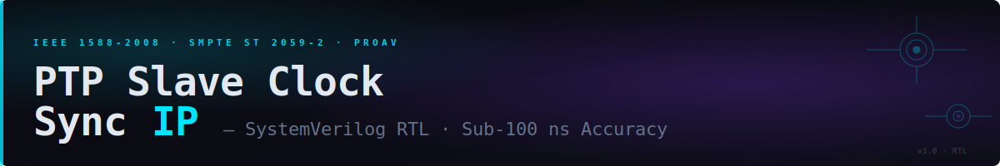

# MACNICA - IEEE 1588 PTP Slave Clock Synchronization IP

<p align="center">
  
</p>

<p align="center">
  <a href="#"></a>
  <a href="#"></a>
  <a href="#"></a>
  <a href="#"></a>
  <a href="#"></a>
  <a href="LICENSE"></a>
  <a href=".github/workflows/sim.yml"></a>
</p>

---

A fully self-contained **IEEE 1588-2008 PTP Slave / Ordinary Clock** synchronization IP core written in synthesizable SystemVerilog. Designed for deployment in **ProAV encoder and decoder SoCs** operating within Ethernet II networks managed by a **Mellanox Onyx Boundary Clock** infrastructure (SMPTE ST 2059-2 profile, domain 127).

The IP recovers the Grandmaster clock with **sub-100 nanosecond accuracy** using PHY-layer hardware timestamping, a PI servo controller, and the full Best Master Clock Algorithm (BMCA) defined in IEEE 1588-2008.

---

## Table of Contents

- [Features](#features)
- [Architecture Overview](#architecture-overview)
- [Repository Structure](#repository-structure)
- [Quick Start](#quick-start)
- [Module Reference](#module-reference)
- [Port Interface](#port-interface)
- [PTP Profile Defaults](#ptp-profile-defaults)
- [Timing & Performance](#timing--performance)
- [Security Features](#security-features)
- [Simulation](#simulation)
- [Synthesis](#synthesis)
- [Integration Guide](#integration-guide)
- [Troubleshooting](#troubleshooting)
- [References](#references)
- [License](#license)

---

## Features

| Capability | Detail |
|---|---|
| **Protocol** | IEEE 1588-2008 Two-Step Slave / Ordinary Clock |
| **PTP Profile** | SMPTE ST 2059-2 (default) · AES67 · AESr16 compatible |
| **Transport** | Ethernet II (0x88F7) · IPv4/UDP (port 319/320) |
| **Timestamp width** | 80-bit: 48-bit seconds + 32-bit nanoseconds |
| **Clock frequency** | 125 MHz (8 ns resolution), parameterisable |
| **Target accuracy** | < 100 ns offset-from-master (LAN, PTP-aware fabric) |
| **BMCA** | Full 6-field cascaded comparison per §9.3.4 |
| **Port FSM** | 9 states: INIT → LISTENING → UNCALIBRATED → SLAVE |
| **Servo** | PI controller, fixed-point shift gains, ±10 ms anti-windup |
| **Security** | AMT (8-entry), forced-master, domain filter |
| **Interface** | AXI4-Stream RX/TX (8-bit) + PHY HW timestamp strobes |
| **Config** | Register-file driven, fully parameterisable |

---

## Architecture Overview

```
┌─────────────────────────────────────────────────────────────────┐
│                      ptp_sync_wrapper                           │
│                                                                 │
│  ┌──────────────────┐        ┌───────────────────────────────┐  │
│  │  ptp_msg_parser  │──────▶│      ptp_slave_sync_top       │  │
│  │                  │        │                               │  │
│  │  • Frame decode  │        │  ┌────────┐  ┌────────────┐  │  │
│  │  • HW TS latch   │        │  │HW Clock│  │Servo Clock │  │  │
│  │    (T2 @ SFD)    │        │  │125 MHz │  │PI corrected│  │  │
│  │  • Sync/FollowUp │        │  └────────┘  └────────────┘  │  │
│  │  • Delay_Resp    │        │  ┌──────────────────────────┐ │  │
│  │  • Announce      │        │  │    BMCA Engine           │ │  │
│  └──────────────────┘        │  │ Prio1/Class/Acc/Var/...  │ │  │
│                               │  └──────────────────────────┘ │  │
│  ┌──────────────────┐        │  ┌──────────────────────────┐ │  │
│  │ptp_delay_req_    │◀───────│  │  Port State FSM (9-state)│ │  │
│  │   framer         │        │  └──────────────────────────┘ │  │
│  │                  │        │  ┌──────────────────────────┐ │  │
│  │  • Build frame   │        │  │  Timestamp Engine        │ │  │
│  │  • TX AXI4-S     │        │  │  T1/T2/T3/T4 · OFM · MPD│ │  │
│  │  • T3 capture    │        │  └──────────────────────────┘ │  │
│  └──────────────────┘        │  ┌──────────────────────────┐ │  │
│                               │  │  PI Servo Controller     │ │  │
│  MAC RX ──▶ [parser]          │  │  Kp=2⁻⁴  Ki=2⁻⁸         │ │  │
│  MAC TX ◀── [framer]          │  └──────────────────────────┘ │  │
│  PHY TS ──▶ [both]            └───────────────────────────────┘  │
└─────────────────────────────────────────────────────────────────┘
```

### Two-Step Timestamp Exchange

```
MASTER (GM)                              SLAVE (this IP)
    │                                         │
    │──── Sync_message ──────────────────────▶│  T1 → Follow_Up
    │                                     T2 ←│  (PHY HW RX timestamp @ SFD)
    │──── Follow_Up (T1) ────────────────────▶│
    │                                         │
    │◀─── Delay_Request ──────────────────────│  T3 (PHY HW TX timestamp)
T4 →│                                         │
    │──── Delay_Response (T4) ───────────────▶│

  Clock_Offset  = [ (T2-T1) - (T4-T3) ] / 2
  Mean_Path_Dly = [ (T2-T1) + (T4-T3) ] / 2
```

---

## Repository Structure

```
ptp-slave-sync-ip/
├── rtl/                          # Synthesizable RTL sources
│   ├── ptp_sync_wrapper.sv       # Top-level integration wrapper
│   ├── ptp_slave_sync_top.sv     # Core engine (BMCA, servo, clock, FSM)
│   ├── ptp_msg_parser.sv         # AXI4-Stream PTP frame parser
│   └── ptp_delay_req_framer.sv   # Delay_Request TX frame builder
│
├── tb/                           # Verification
│   ├── tb_ptp_sync_wrapper.sv    # Top-level directed testbench
│   └── waves/                    # VCD waveform captures (generated)
│
├── docs/                         # Documentation
│   ├── microarchitecture.html    # Interactive design document
│   ├── MICROARCH.md              # Microarchitecture markdown
│   └── images/                   # Diagrams and figures
│
├── scripts/                      # EDA tool scripts
│   ├── sim_icarus.sh             # Icarus Verilog simulation
│   ├── sim_questa.tcl            # Questa/ModelSim simulation
│   └── synth_vivado.tcl          # Xilinx Vivado synthesis
│
├── constraints/                  # Timing constraints
│   └── ptp_sync.xdc              # Vivado XDC timing constraints
│
├── .github/
│   └── workflows/
│       └── sim.yml               # CI: auto-simulate on push
│
├── CHANGELOG.md
├── CONTRIBUTING.md
├── LICENSE
└── README.md                     ← you are here
```

---

## Quick Start

### Prerequisites

- **Simulation:** [Icarus Verilog](https://github.com/steveicarus/iverilog) ≥ 11.0 (free) or Questa / VCS / Xcelium
- **Synthesis:** Xilinx Vivado 2022.x+ or Intel Quartus Prime 21.x+
- **Waveforms:** [GTKWave](http://gtkwave.sourceforge.net/) (optional)

### Clone & Simulate

```bash
git clone https://github.com/your-org/ptp-slave-sync-ip.git
cd ptp-slave-sync-ip

# Run all tests with Icarus Verilog
bash scripts/sim_icarus.sh

# Open waveforms
gtkwave tb/waves/ptp_sync_tb.vcd
```

### Questa / ModelSim

```tcl
# In Questa console
do scripts/sim_questa.tcl
```

### Vivado Synthesis

```tcl
# In Vivado Tcl console
source scripts/synth_vivado.tcl
```

---

## Module Reference

### `ptp_sync_wrapper` — Integration Boundary

The single module to instantiate in your encoder/decoder SoC. Wires together all three submodules.

**Parameters:**

| Parameter | Default | Description |
|---|---|---|
| `CLK_FREQ_HZ` | `125_000_000` | System clock frequency in Hz |
| `SRC_MAC` | `48'hDE_AD_BE_EF_00_01` | Source MAC address of this device |
| `CLOCK_ID` | `64'hDEAD_BEEF_CAFE_0001` | PTP ClockIdentity (EUI-64, derive from MAC) |
| `AMT_DEPTH` | `8` | Number of Acceptable Master Table entries |
| `PTP_DOMAIN` | `127` | PTP domain number (SMPTE ST 2059-2 = 127) |

---

### `ptp_slave_sync_top` — Core Engine

Contains all protocol logic. Key internal blocks:

| Block | Description |
|---|---|
| **HW Clock** | Free-running 80-bit PTP clock incremented at `CLK_FREQ_HZ`. 48-bit seconds + 32-bit nanoseconds. Wraps at 1,000,000,000 ns. |
| **Servo Clock** | Corrected clock register. Receives nanosecond step adjustments from the PI servo on each valid measurement. |
| **BMCA Engine** | Processes Announce messages. 6-field cascaded comparison (Priority1 → ClockClass → ClockAccuracy → ClockVariance → Priority2 → ClockId). Announce timeout counter resets on each valid message. |
| **Port State FSM** | 9-state IEEE 1588-2008 FSM. Normal slave path: INIT → LISTENING → UNCALIBRATED → SLAVE. Returns to LISTENING on announce timeout or GM failover triggers UNCALIBRATED. |
| **Timestamp Engine** | Captures T1 (Follow_Up), T2 (PHY RX HW TS), T3 (PHY TX HW TS), T4 (Delay_Resp). Computes OFM and MPD using 64-bit arithmetic. |
| **PI Servo** | Fixed-point PI: Kp = 2⁻⁴, Ki = 2⁻⁸. Integrator anti-windup clamped at ±10 ms. Clock lock declared at |OFM| < 1 µs. |

---

### `ptp_msg_parser` — Frame Parser

Byte-stream parser consuming the AXI4-Stream output from the MAC RX path.

- Detects PTP over **Ethernet II** (EtherType `0x88F7`) and **IPv4/UDP** (ports 319/320)
- Latches the PHY hardware RX timestamp on the `rx_tuser` SFD strobe (T2)
- Extracts and presents all IEEE 1588 common header fields plus message-type-specific body fields
- Decodes: `Sync`, `Follow_Up`, `Delay_Response`, `Announce`

---

### `ptp_delay_req_framer` — TX Frame Builder

Builds and transmits IEEE 1588 `Delay_Request` frames on demand.

- 58-byte Ethernet II frame, PTP multicast DA `01:1B:19:00:00:00`
- 3-state FSM: `IDLE` → `SEND` → `WAIT_TS`
- Captures T3 from PHY TX hardware timestamp after SFD
- Rate controlled by `ptp_slave_sync_top` at the configured `logSyncInt` interval

---

## Port Interface

### Primary I/O — `ptp_sync_wrapper`

```systemverilog
module ptp_sync_wrapper #(
    parameter int unsigned CLK_FREQ_HZ  = 125_000_000,
    parameter logic [47:0] SRC_MAC      = 48'hDE_AD_BE_EF_00_01,
    parameter logic [63:0] CLOCK_ID     = 64'hDEAD_BEEF_CAFE_0001,
    parameter int unsigned AMT_DEPTH    = 8,
    parameter int unsigned PTP_DOMAIN   = 127
) (
    // System
    input  logic        clk,            // 125 MHz system clock
    input  logic        rst_n,          // Active-low async reset

    // MAC RX — AXI4-Stream (byte-wide)
    input  logic [7:0]  rx_tdata,
    input  logic        rx_tvalid,
    input  logic        rx_tlast,
    input  logic        rx_tuser,       // SFD pulse → latches T2

    // PHY Hardware Timestamps
    input  logic [79:0] phy_rx_timestamp,   // {sec[47:0], ns[31:0]}
    input  logic [79:0] phy_tx_timestamp,   // T3 source
    input  logic        phy_tx_ts_valid,    // T3 strobe

    // MAC TX — AXI4-Stream (Delay_Req frames)
    output logic [7:0]  tx_tdata,
    output logic        tx_tvalid,
    output logic        tx_tlast,
    input  logic        tx_tready,

    // Recovered Clock
    output logic [47:0] local_time_sec,     // Servo-corrected seconds
    output logic [31:0] local_time_ns,      // Servo-corrected nanoseconds
    output logic        pps_out,            // 1-cycle pulse-per-second
    output logic        clock_locked,       // |OFM| < 1 µs

    // Servo Diagnostics
    output logic signed [31:0] offset_from_master,  // Signed, nanoseconds
    output logic        [31:0] mean_path_delay,      // Unsigned, nanoseconds
    output logic        ofm_threshold_alarm,
    output logic        mpd_threshold_alarm,

    // PTP Status
    output logic [2:0]  ptp_port_state,     // 0=INIT 1=LISTEN 2=UNCALIB 3=SLAVE …
    output logic        grandmaster_changed, // 1-cycle strobe
    output logic [63:0] current_gm_id,      // Active GM ClockIdentity
    output logic        amt_violation,
    output logic        forced_master_event,

    // Configuration
    input  logic        cfg_slave_only,
    input  logic        cfg_forced_master,
    input  logic [7:0]  cfg_domain_num,
    input  logic [AMT_DEPTH-1:0][63:0] cfg_amt_table,
    input  logic [AMT_DEPTH-1:0]       cfg_amt_valid
);
```

---

## PTP Profile Defaults

Defaults follow **SMPTE ST 2059-2** as used by Mellanox Onyx Boundary Clocks in ProAV deployments. Values are also within the AES67 and AESr16 compatibility ranges.

| Parameter | Default | Range | Notes |
|---|---|---|---|
| PTP Domain | 127 | 0–127 | SMPTE-reserved |
| Sync Interval | −3 (8 Hz) | −7 to −1 | 125 ms period |
| Announce Interval | −2 (4 Hz) | −3 to 1 | 250 ms period |
| Announce Timeout | 3× | 2–10 | 750 ms total |
| Delay_Req Interval | = logSyncInt | logSyncInt…+5 | Matched to Sync |
| Priority 1 | 128 | 0–255 | Slave endpoint |
| Priority 2 | 128 | 0–255 | Tiebreaker |
| OFM Alarm | 100,000 ns | User | 100 µs threshold |
| MPD Alarm | 1,000,000 ns | User | 1 ms threshold |

---

## Timing & Performance

| Metric | Value | Condition |
|---|---|---|
| Clock resolution | 8 ns | @ 125 MHz |
| Target OFM | < 100 ns | PTP-aware fabric, BC at ToR |
| Servo Kp | 2⁻⁴ (1/16) | Conservative for 8 Hz sync |
| Servo Ki | 2⁻⁸ (1/256) | Slow integrator, stable LAN |
| Anti-windup | ±10 ms | Prevents runaway on timeout |
| Lock threshold | ±1 µs | `clock_locked` assertion |
| Announce timeout | 750 ms | 3 × 250 ms @ −2 log interval |

> **Note:** Sub-100 ns accuracy requires hardware timestamping at the PHY/MAC SFD boundary. The `rx_tuser` and `phy_tx_ts_valid` strobes must be driven by the PHY timestamping unit — not the MAC FIFO output. See [Integration Guide](#integration-guide).

---

## Security Features

### Acceptable Master Table (AMT)

Prevents rogue time sources. Only Announce messages from whitelisted ClockIdentities are accepted by the BMCA.

```systemverilog
// Whitelist a Grandmaster by ClockIdentity (EUI-64)
cfg_amt_table[0] = 64'hAABB_CCDD_EEFF_0001;
cfg_amt_valid[0] = 1'b1;
// Equivalent Mellanox Onyx CLI:
// switch(config)# ptp amt 00:AA:BB:CC:DD:EE:FF:01
```

When all `cfg_amt_valid` bits are zero, the AMT operates in **open mode** (all sources accepted).

### Forced-Master Port

Discards all incoming Announce messages on the interface. Prevents misconfigured or compromised devices from injecting themselves into the BMCA.

```systemverilog
cfg_forced_master = 1'b1;
// Equivalent Mellanox Onyx CLI:
// switch(config)# interface ethernet x/y ptp enable forced-master
```

### Domain Filter

Messages with `domainNumber ≠ cfg_domain_num` are silently discarded before any processing. Default domain is 127 (SMPTE ST 2059-2).

---

## Simulation

### Icarus Verilog (free, recommended for CI)

```bash
bash scripts/sim_icarus.sh
```

This compiles all RTL + TB, runs the simulation, and prints a pass/fail summary. VCD is written to `tb/waves/ptp_sync_tb.vcd`.

### Questa / ModelSim

```tcl
do scripts/sim_questa.tcl
```

### Test Coverage

| Test | Description | Expected |
|---|---|---|
| TEST-01 | Reset → LISTENING | Port state = 1 within 3 cycles |
| TEST-02 | Announce injection / BMCA | `current_gm_id` matches injected GM |
| TEST-03 | AMT violation | `amt_violation` asserted |
| TEST-04 | Forced-master | `forced_master_event` asserted, BMCA unchanged |
| TEST-05 | Sync + Follow_Up | T1/T2 captured, seqId matched |
| TEST-06 | Delay_Req TX + T3 | TX triggered at logSyncInt rate, T3 from PHY |
| TEST-07 | OFM/MPD computation | Values match analytical formula |
| TEST-08 | Servo convergence | `clock_locked` asserts within N cycles |
| TEST-09 | Announce timeout | Port returns to LISTENING |
| TEST-10 | GM failover | `grandmaster_changed` strobe, re-enters UNCALIB |

---

## Synthesis

### Vivado (Xilinx / AMD)

```bash
vivado -mode tcl -source scripts/synth_vivado.tcl
```

**Target resource estimate (Xilinx Artix-7 / UltraScale+):**

| Resource | Estimate |
|---|---|
| LUTs | ~1,800 – 2,400 |
| FFs | ~1,400 – 1,800 |
| BRAM | 0 |
| DSP | 0 (all shifts, no multipliers in servo) |
| Fmax | > 200 MHz (125 MHz target, ample margin) |

> Resource figures are estimates. Actual results depend on target device, synthesis settings, and integration context.

---

## Integration Guide

### 1. PHY Hardware Timestamping

The accuracy of this IP depends entirely on **PHY-level timestamping at the SFD boundary**. The `rx_tuser` strobe must be asserted during the AXI4-Stream transfer of the **first byte of the preamble/SFD**, coincident with `phy_rx_timestamp` being valid.

Common PHY/MAC IPs with integrated PTP timestamping:
- **Xilinx 1G/2.5G Ethernet Subsystem** — provides SFD-aligned timestamps
- **Intel/Altera Triple-Speed Ethernet** — `ptp_ts_96b` output
- **Mellanox ConnectX** — hardware timestamping built-in

### 2. ClockIdentity Assignment

Derive `CLOCK_ID` from the device MAC address per IEEE 1588-2008 §7.5.2.2 (EUI-64 construction):

```
ClockId = MAC[47:24] | 0xFF_FE | MAC[23:0]
Example: MAC = DE:AD:BE:EF:00:01
         ClockId = 0xDEAD_BEFF_FEEF_0001
```

### 3. Register File Interface

Connect `cfg_*` inputs to your SoC's register file. Minimum required at boot:

```systemverilog
cfg_domain_num   = 8'd127;   // SMPTE ST 2059-2 domain
cfg_slave_only   = 1'b1;     // ProAV endpoints are slaves only
cfg_forced_master= 1'b0;
cfg_amt_valid    = '0;       // Open AMT (populate for security)
```

### 4. AXI4-Stream Connection

```
MAC RX datapath:
  mac_rx_tdata  ──▶ rx_tdata
  mac_rx_tvalid ──▶ rx_tvalid
  mac_rx_tlast  ──▶ rx_tlast
  sfd_pulse     ──▶ rx_tuser    (⚠ must be PHY SFD, not MAC FIFO)

MAC TX datapath:
  tx_tdata  ──▶ mac_tx_tdata
  tx_tvalid ──▶ mac_tx_tvalid
  tx_tlast  ──▶ mac_tx_tlast
  mac_tx_tready ──▶ tx_tready
```

### 5. Clock Domain

All logic is **single clock domain** (`clk` at 125 MHz). No CDC crossings are required within this IP. If your MAC operates at a different clock (e.g., 156.25 MHz for 10GbE), add an AXI4-Stream clock-domain crossing FIFO before `rx_tdata`.

---

## Troubleshooting

Aligned with Section 18 of the Mellanox Onyx IEEE 1588 Design Guide:

| Symptom | Likely Cause | Check |
|---|---|---|
| Port stuck in LISTENING | No Announce received | Domain number mismatch? `cfg_domain_num` vs GM domain |
| Port stuck in UNCALIBRATED | No valid OFM measurement | T3/T4 not completing — check `phy_tx_ts_valid` strobe |
| Large OFM oscillation | Message rate mismatch | Confirm Sync interval consistent master ↔ slave |
| `amt_violation` constant | AMT loaded with wrong IDs | Check `cfg_amt_table` values vs actual GM ClockIdentity |
| `clock_locked` never asserts | Servo not converging | Verify T2 timestamp is PHY SFD-aligned, not MAC FIFO |
| Announce timeout loops | Network congestion on PTP path | Apply DSCP 46 QoS marking to PTP traffic at switch |
| Multiple GMs fighting | BMCA Priority1 not set | Ensure non-GM devices have `clock_class ≥ 128` |

---

## References

- [IEEE 1588-2008](https://doi.org/10.1109/IEEESTD.2008.4579760) — IEEE Standard for a Precision Clock Synchronization Protocol
- [SMPTE ST 2059-2](https://doi.org/10.5594/SMPTE.ST2059-2.2015) — SMPTE Profile for IEEE-1588 in Professional Broadcast
- [AES67-2018](http://www.aes.org/publications/standards/search.cfm?docID=96) — High-performance streaming audio-over-IP
- [AES-R16-2016](http://www.aes.org/publications/standards/search.cfm?docID=105) — PTP parameters for AES67 and SMPTE ST 2059-2 interoperability
- [Mellanox Onyx IEEE 1588 PTP Design Guide](https://www.mellanox.com) — Boundary Clock deployment reference
- [EBU Tech Review: PTP in Broadcasting Part 1](https://tech.ebu.ch/files/live/sites/tech/files/shared/techreview/trev_2018-Q2_PTP_in_Broadcasting_Part_1.pdf)
- [EBU Tech Review: PTP in Broadcasting Part 3 — Network Design](https://tech.ebu.ch/docs/techreview/trev_2019-Q4_PTP_in_Broadcasting_Part_3.pdf)

---

## License

This project is licensed under the **MIT License** — see [LICENSE](LICENSE) for details.

---

<p align="center">
  <sub>Built for ProAV · IEEE 1588-2008 · SMPTE ST 2059-2 · Mellanox Onyx Compatible</sub>
</p>
